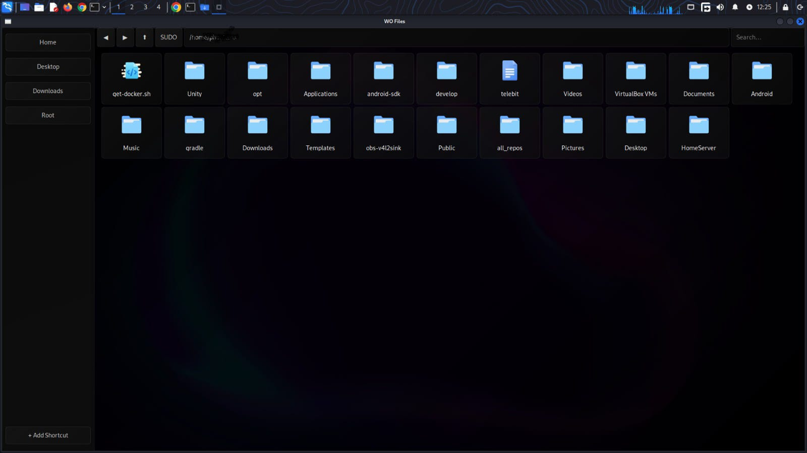
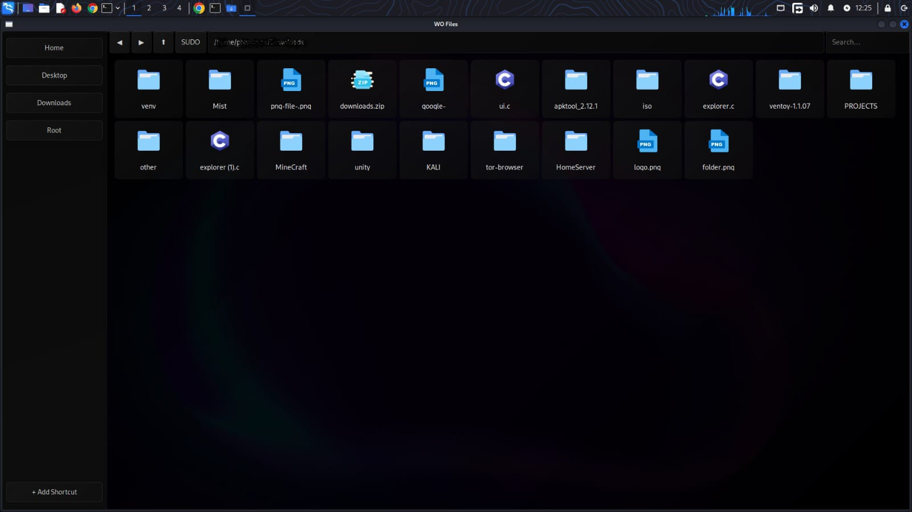

# **WO Files – Ultra-Modern GTK File Manager 🗂️⚡🔥**

WO Files is a **modern, lightweight, drag-and-drop themeable file manager** built in **pure C + GTK3**.
Featuring an **OLED UI**, smooth glass effects, custom icons, fast performance, and an insane level of polish — all crafted in C with pain and anger.

This is not “just another file manager”.
This is **WO Files**, an aesthetic, hacker-grade, ultra-fast explorer.

---

## ✨ **Features**

🔮 **Modern OLED UI** with glass morphism (idk kinda)

🎨 **Theme Engine + .WO Theme Packages (drag & drop install)**

📁 **Icon Grid View** (custom icons per file type)

🔍 **Instant Search** (filter + live update) (janky needs improvement)

⏪ **History Navigation** — Back / Forward / Up

✂️ **File Ops:** Copy, Cut, Paste, Rename, Delete

🖱️ **Right-Click Context Menu**

🔒 **Instant SUDO Mode** (browse system dirs seamlessly)

📌 **Custom Sidebar Shortcuts**

🧠 **Smart Icon Matching** (guess icon from extension)

💬 **Status Bar:** item count | free space

---

## 🧩 **.WO Theme Format (Drag & Drop Themes)**

WO Files now supports custom **`.wo` theme bundles**.

A `.wo` file is simply:

```
THEMENAME: My Cool Theme
/* CSS START */
window {
    background: linear-gradient(135deg, ...);
}
/* CSS END */
```

### 🔥 How it works:

* Drag **any `.wo` file** into the WO Files window
* The app:

  * Extracts the theme name
  * Applies the CSS instantly
  * Adds it to the theme dropdown
  * Saves it to `assets/themes/yourtheme.wo`

No restart. No rebuilding.
Just ✨ **drop → apply**.

---

## 🎨 **Included Themes**

Stored in:

```
assets/themes/
│── oled.css
│── red.css
│── blue.css
```
✨Demo WO files are also included under /wo-files folder

You can add unlimited themes via `.wo` files.

---

## 📸 **Screenshots**

  

---

## 🛠️ **Build Instructions**

### Install GTK3

```bash
sudo apt install libgtk-3-dev
```

### Build

```bash
git clone https://github.com/dwip-the-dev/WO-Files.git
cd WO-Files
make clean
make
./wo-files
```

---

## 📂 **Project Structure**

```
WO-Files/
│── assets/
│   ├── <file icons>.png
│   ├── bgwofiles.png
│   ├── ss1.png
│   ├── ss2.png
│   ├── themes/
│   │   ├── oled.css    //default themes
│   │   ├── red.css
│   │   └── blue.css
│── src/
│   ├── main.c
│   ├── explorer.c
│   ├── explorer.h
│   ├── ui.c
│   ├── ui.h
│   ├── utils.c
│   ├── utils.h
│── Makefile
│── LICENSE
│── README.md
```

---

## 🎨 **Icon Credits**

Icons by **[Icons8](https://icons8.com/)** ❤️
Thanks for the clean visuals!

---

## 🌟 **Contribute**

PRs are welcome for:

* New themes
* Feature additions
* UI improvements
* Performance optimizations
* Bug fixes

---

## 👨‍💻 **Author**

Built with ❤️ by **Dwip**
